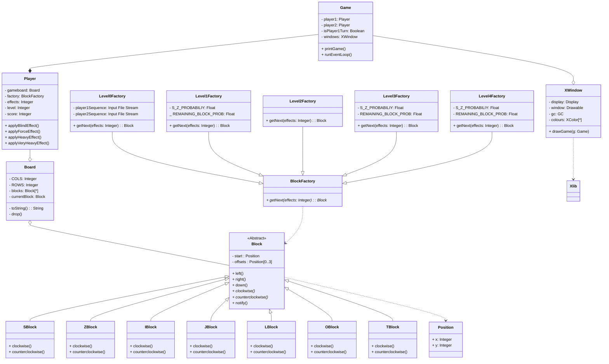

# UML Diagram for Biquadris

```mermaid
classDiagram
    class Block {
        - start : Position
        - offsets : Position[0..3]
        + left()
        + right()
        + down()
        + clockwise()*
        + counterclockwise()*
        + notify()
    }
    <<Abstract>> Block
    class IBlock {
        + clockwise()
        + counterclockwise()
    }
    class JBlock {
        + clockwise() 
        + counterclockwise()
    }
    class LBlock {
        + clockwise()
        + counterclockwise()
    }
    class OBlock {
        + clockwise()
        + counterclockwise()
    }
    class SBlock {
        + clockwise()
        + counterclockwise()
    }
    class ZBlock {
        + clockwise()
        + counterclockwise()
    }
    class TBlock {
        + clockwise()
        + counterclockwise()
    }
    class Player {
        - gameboard: Board
        - factory: BlockFactory
        - effects: Integer
        - level: Integer
        - score: Integer
        + applyBlindEffect()
        + applyForceEffect()
        + applyHeavyEffect()
        + applyVeryHeavyEffect()
    }
    class Board {
        - COLS: Integer
        - ROWS: Integer
        - blocks: Block[*]
        - currentBlock: Block
        - toString(): String
        - drop()
    }
    class Game {
        - player1: Player
        - player2: Player
        - isPlayer1Turn: Boolean
        - windows: XWindow
        + printGame()
        + runEventLoop()
    }
    class XWindow {
        - display: Display
        - window: Drawable
        - gc: GC 
        - colours: XColor[*]
        + drawGame(g: Game)
    }

    class BlockFactory {
        + getNext(effects: Integer)*: Block
    }

    class Level0Factory {
        - player1Sequence: Input File Stream
        - player2Sequence: Input File Stream
        + getNext(effects: Integer): Block
    }

    class Level1Factory {
        - S_Z_PROBABILIY: Float
        _ REMAINING_BLOCK_PROB: Float
        + getNext(effects: Integer): Block
    }

    class Level2Factory {
        + getNext(effects: Integer): Block
    }

    class Level3Factory {
        - S_Z_PROBABILIY: Float
        - REMAINING_BLOCK_PROB: Float
        + getNext(effects: Integer): Block
    }

    class Level4Factory {
        - S_Z_PROBABILIY: Float
        - REMAINING_BLOCK_PROB: Float
        + getNext(effects: Integer): Block
    }
    
    
    Block <|-- SBlock
    Block <|-- ZBlock
    Block <|-- IBlock
    Block <|-- JBlock
    Block <|-- LBlock
    Block <|-- OBlock
    Block <|-- TBlock
    Board o-- Block
    BlockFactory ..> Block
    Game --o XWindow
    Game --* Player
    Player --o Board
    XWindow ..> Xlib
    Level0Factory --|> BlockFactory
    Level1Factory --|> BlockFactory
    Level2Factory --|> BlockFactory
    Level3Factory --|> BlockFactory
    Level4Factory --|> BlockFactory
    Block ..> Position

    class Position {
        + x: Integer
        + y: Integer
    }
```
