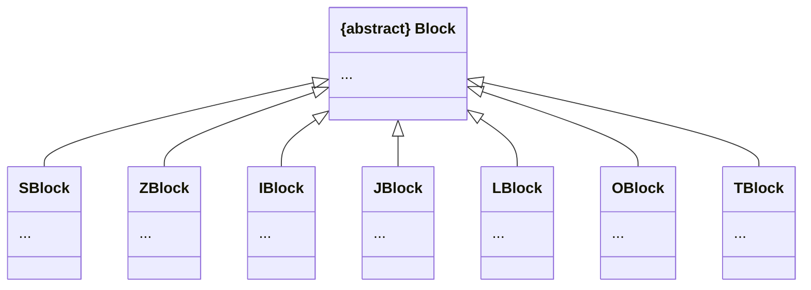

# UML Diagram for Biquadris

```mermaid
classDiagram
    class Block["{abstract} Block"] {
        ...
    }
    class IBlock {
      ...
    }
    class JBlock {
        ...
    }
    class LBlock {
        ...       
    }
    class OBlock {
        ...
    }
    class SBlock {
        ...
    }
    class ZBlock {
      ...
    }
    class TBlock {
        ...
    }
    Block <|-- SBlock
    Block <|-- ZBlock
    Block <|-- IBlock
    Block <|-- JBlock
    Block <|-- LBlock
    Block <|-- OBlock
    Block <|-- TBlock
```
