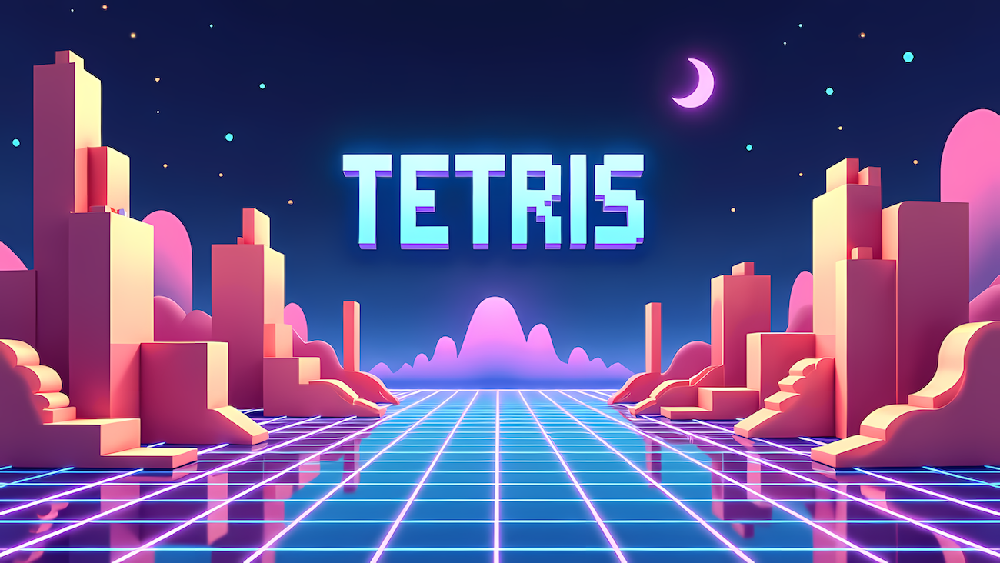
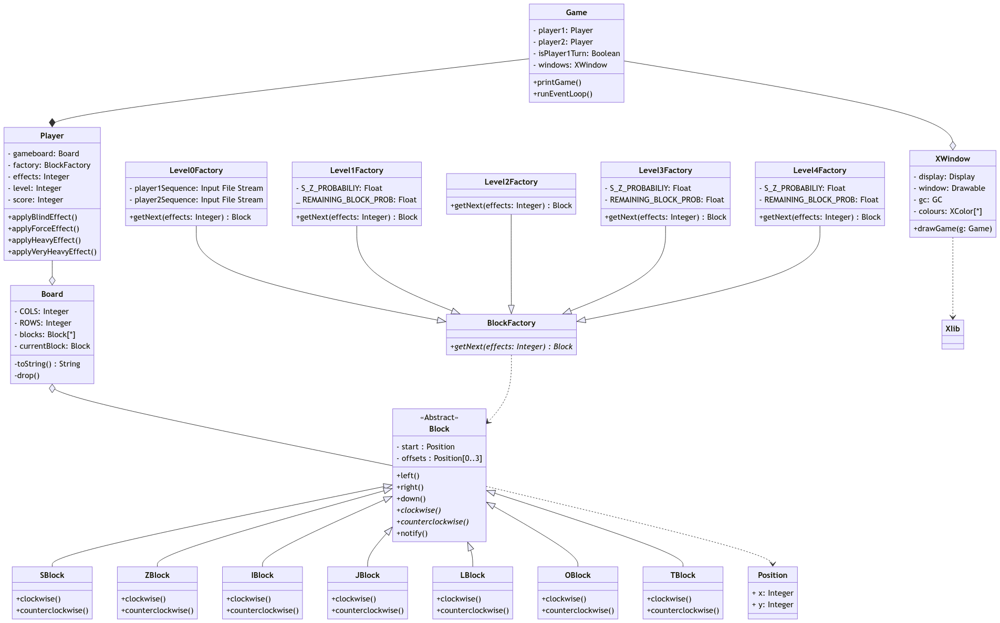
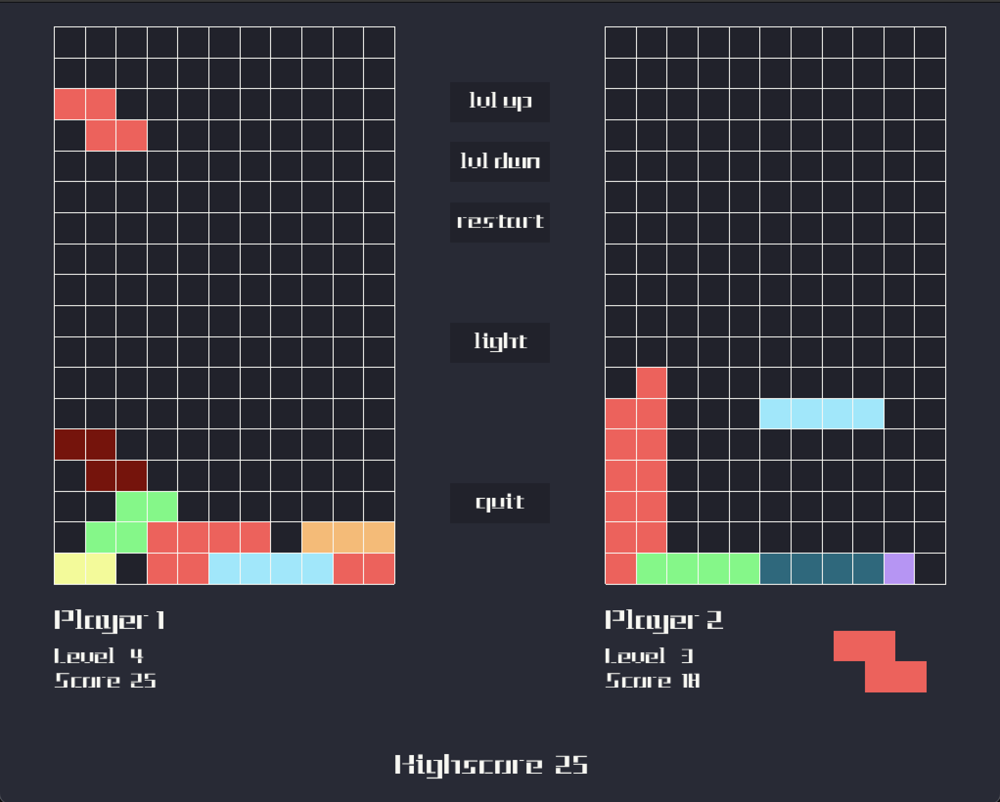

# 🧩 Tetris Showdown: A 2-Player Battle of Blocks!

## 🚀 Epic Features
 - 🖥️ Immersive GUI powered by SDL2 and OpenGL
 - 🧠 Blazing-fast multithreaded game logic (producer-consumer model)
 - 🎵 Ear-candy sound effects to amplify your experience
 - 🎨 3 stunning themes to suit your mood (Dracula, Dark+, and Light+)
 - 💪 4 pulse-pounding difficulty levels to test your mettle 
 - 🧩 7 unique pieces with varying styles
 - 🔄 4x4, 10x10, and 15x15 grid sizes to challenge your skills
 - 📚 TUI for those who prefer a more minimalist approach
 - 🤖 CLI for running tests, checking memory, and more
 - 🔓 Open source and free to play (and customizable if you're feeling adventurous)

## 🕹️ Game Description
This isn't your typical Tetris – it's a 2-player, turn-based game on a single screen. There is no times, but there is a winner. Developed in C++, this game uses SDL2 and OpenGL to create an engaging visual experience.

Born from a school project deadline for an OOP class, this game showcases the results of dedicated coding sessions and creative problem-solving. (Note: The commit history might reveal some interesting late-night coding decisions! Please don't judge too harshly, we were under a lot of pressure.)

Grab a friend, warm up those fingers, and prepare to stack and clear blocks in this Tetris face-off. Let's see who comes out on top!

## 🧠 Design Decisions
We made lots of design decisions that contributed to the final product. See full writeup [here](./design.pdf). Here are some of the most important ones:

### 🧩 Game Architecture
- Multithreaded design: Input thread, rendering thread, and main game loop
- Thread-safe player command queues using mutex and conditional variables

### 🏗️ Block System
- Block factory design pattern for efficient block generation
- Abstract block class with 8 inheritor classes for unique block types
- Offset-based block representation for easy transformations and rotations

### 👥 Player and Board Logic
- Player attributes: score, level, BlockFactory, and effects (stored as prime numbers)
- Board constructed from multiple blocks stored in a vector
- Observer pattern for handling row deletions and score calculations

### 🎮 Game Object
- Central management of game components (window, players, turn tracking)
- Extensible design allowing multiple game instances on separate threads

### 🖼️ Graphics and UI
- SDL2 and OpenGL for improved performance over Xlib
- Separate thread for SDL2 event loop
- Custom text rendering using OpenGL textures. This was a pain to implement, but it was worth it.

### 🔄 Resilience to Change
- Modular design with abstract classes and pure virtual functions
- Easy implementation of new blocks, effects, and levels
- Methods to interact with private fields, maintaining structural integrity

### 🎛️ Command System
- Efficient command interpreter using string comparisons
- Extensible design for adding new commands with minimal recompilation
- Support for command renaming and macro language using unordered map

## 🎮 How to Play
1. Grab yourself a friend, keyboard, and compatible computer (recent MacOS and most Linux distros should work)
2. Clone the repository and navigate to the project directory.
3. Run `make` to compile the game. Ensure you have the necessary dependencies installed.
4. Run the executable generated. To get the full experience, run it with the `-bonus` flag.
5. See [here](./Documents/biquadris.pdf) for rules, controls, and more.

## ️️⚙️ Class Diagram (UML)
A very simplified UML of the project. This was kind of rushed, but it gets the point across.

## Gameplay Preview

## 🤝 Contributors

